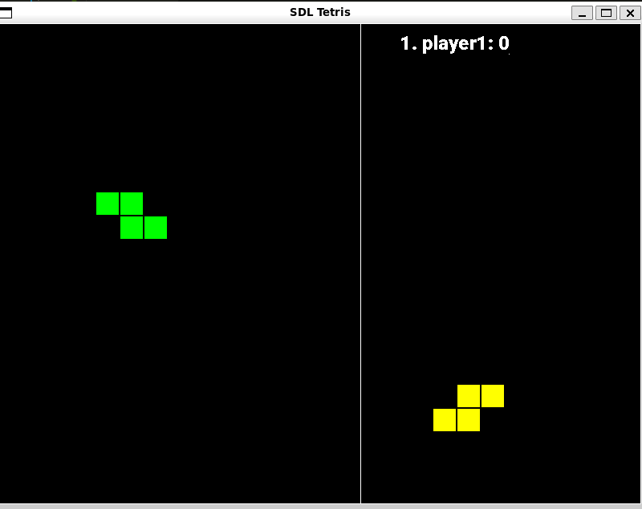

### Compilation Instructions

#### 1. Create the database
1. Update package list
   - Linux
   ```bash
   sudo apt update
   ```


2. Install PostgreSQL
   - Linux
   ```bash
   sudo apt install postgresql postgresql-contrib
   ```
   - macOS
   ```zsh
   brew install postgresql   
   ```

3. Start PostgreSQL Service
   - Linux
   ```bash
   sudo service postgresql start
   ```
   - macOS
   ```bash
   brew services start postgresql
   ```

4. Switch to the PostgreSQL User: Switch to postgres user to perform admin tasks:
   ```bash
   sudo -i -u postgres
   ```
5. Create New PostgreSQL User (Yes, This is required!)
   ```bash
   createuser --interactive
   psql -c "CREATE USER new_user WITH PASSWORD '1';"
   ```
6. Create the Database and Grant all priviledge: 
   ```bash
   createdb tetris

   psql -c "GRANT ALL PRIVILEGES ON DATABASE tetris TO new_user;"

   psql -d tetris
   ```
7. Create the Tables:
   ```postgresql
   CREATE TABLE IF NOT EXISTS users (
    user_id SERIAL PRIMARY KEY,
    username VARCHAR(50) UNIQUE NOT NULL,
    password_hash VARCHAR(255) NOT NULL,
    created_at TIMESTAMP DEFAULT CURRENT_TIMESTAMP
   );

   CREATE TABLE IF NOT EXISTS sessions (
       session_id VARCHAR(255) PRIMARY KEY,
       username VARCHAR(50) NOT NULL REFERENCES users(username) ON DELETE CASCADE,
       expiration TIMESTAMP NOT NULL
   );
   
   CREATE TABLE IF NOT EXISTS rooms (
       room_id SERIAL PRIMARY KEY,
       room_name VARCHAR(100) UNIQUE NOT NULL,
       host_id INT NOT NULL REFERENCES users(user_id) ON DELETE CASCADE,
       time_limit INT CHECK (time_limit > 0),
       brick_limit INT CHECK (brick_limit > 0),
       max_players INT NOT NULL CHECK (max_players BETWEEN 2 AND 8),
       created_at TIMESTAMP DEFAULT CURRENT_TIMESTAMP
   );
   
   CREATE TABLE IF NOT EXISTS room_players (
       room_id INT NOT NULL REFERENCES rooms(room_id) ON DELETE CASCADE,
       user_id INT NOT NULL REFERENCES users(user_id) ON DELETE CASCADE,
       joined_at TIMESTAMP DEFAULT CURRENT_TIMESTAMP,
       PRIMARY KEY (room_id, user_id)
   );
   
   CREATE TABLE IF NOT EXISTS games (
       game_id SERIAL PRIMARY KEY,
       room_id INT NOT NULL REFERENCES rooms(room_id) ON DELETE CASCADE,
       start_time TIMESTAMP DEFAULT CURRENT_TIMESTAMP,
       end_time TIMESTAMP,
       status INT NOT NULL DEFAULT 1 CHECK (status IN (0, 1))
   );
   
   CREATE TABLE IF NOT EXISTS game_scores (
       game_id INT NOT NULL REFERENCES games(game_id) ON DELETE CASCADE,
       user_id INT NOT NULL REFERENCES users(user_id) ON DELETE CASCADE,
       score INT NOT NULL DEFAULT 0,
       PRIMARY KEY (game_id, user_id)
   );
   ```

#### 2. Install Required Libraries
- Linux
   ```bash
   sudo apt install uuid-dev libsdl2-dev libsdl2-ttf-dev
   ```
- macOS
   ```zsh
   brew install ossp-uuid sdl2 sdl2_ttf
   ```

#### 3. Compile the Server
1. Navigate to the server source directory:
   ```bash
   cd src/server
   ```
2. Run the following command to compile the server:
   - Linux:
   ```bash
   gcc -o server.o server.c ../ultis.c object.c ../protocol/network.c \
       -I../protocol -I../../config -I../ -I/usr/include/postgresql \
       -L/usr/lib -lpthread -lpq -luuid
   ```
   - macOS:
   ```zsh
   gcc -o server.o server.c ../ultis.c object.c ../protocol/network.c \
    -I../protocol -I../../config -I../ -I/opt/homebrew/include/postgresql \
    -I/opt/homebrew/include/ossp \
    -L/opt/homebrew/lib/postgresql@14 -L/opt/homebrew/lib-lpthread -lpq -luuid
   ```
   - **Output**: This will generate an executable file named `server.o` in the `src/server` directory.
   - **NOTE**: 
      - The ```-L``` (Linking) in compile command includes the path to the library
      - Use the ```find /opt/homebrew -name <lib-name>``` for more accurate path, then update the compile command to compile correctly
      - If you can't find the path to the libraries, consider changing the environment path:
         ```
         export DYLD_LIBRARY_PATH=/opt/homebrew/lib:$DYLD_LIBRARY_PATH
         ```
      - Please check the version of 
      postgres, then change the version at ```postgresql@<your-version>``` in the command
   
3. Run the `server.o` to start the Server

#### 4. Compile the Client
1. Navigate to the client source directory:
   ```bash
   cd src
   ```
2. Run the following command to compile the client:
   - Linux
   ```bash
   gcc main.c tetris_game.c client_utils.c ultis.c -o game.o -lSDL2 -lSDL2_ttf -lpthread
   ```
   - macOS
   ```zsh
   gcc main.c tetris_game.c client_utils.c ultis.c -o game.o \
    -I/opt/homebrew/include/SDL2 -L/opt/homebrew/lib -lSDL2 -lSDL2_ttf -lpthread
   ```
   - **Output**: This will generate an executable file named `game.o` in the `src` directory.
   - **NOTE**: AGAIN, please check the path to the SDL2 and SDL2_ttf library for the compiler to link the library accurately
3. Run the `game.o` file to start the game!


